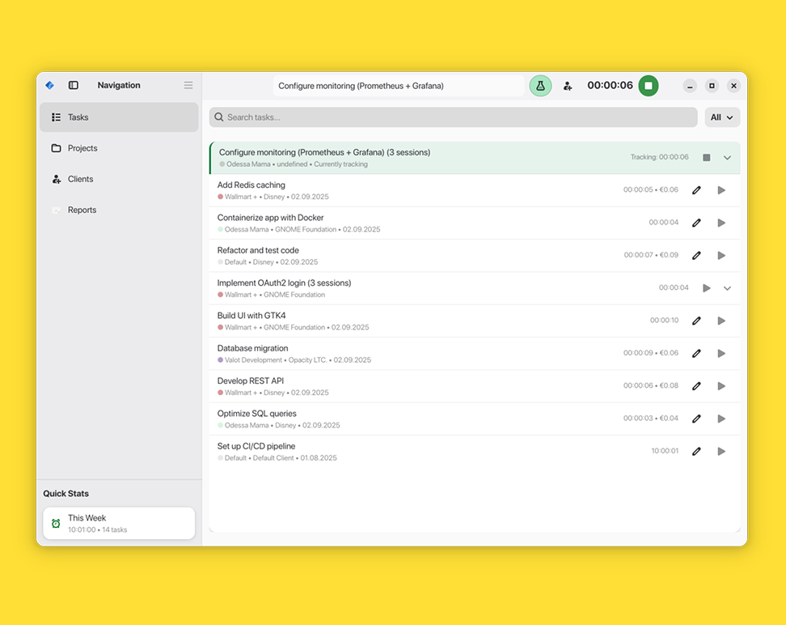

# Valot

A modern time tracking application built with GTK4 and Adwaita.



## Description

Valot is designed for developers, freelancers, and professionals who need to track their work time efficiently. It offers a clean, modern interface that follows GNOME Human Interface Guidelines.

## Features

- **Real-time task tracking** with live timer updates
- **Smart task grouping** and stack management  
- **Project and client organization** with custom colors and icons
- **Comprehensive reporting** with charts and statistics
- **PDF export capabilities** with professional themes
- **Weekly and monthly** time summaries
- **Intuitive right-click selection** for bulk operations

## Installation

### From Flathub

```bash
flatpak install flathub com.odnoyko.valot
```

### Building from Source

Requirements:
- Meson >= 1.0.0
- GTK4
- libadwaita
- libgda
- blueprint-compiler

```bash
git clone https://gitlab.com/Valo27/valot.git
cd valot
meson setup _build
meson compile -C _build
meson install -C _build
```

## Contributing

Contributions are welcome! Please feel free to submit a Pull Request.

## License

This project is licensed under the GPL-3.0-or-later license. See the LICENSE file for details.

## Support

- **Homepage**: https://gitlab.com/Valo27/valot
- **Bug Reports**: https://gitlab.com/Valo27/valot/-/issues
